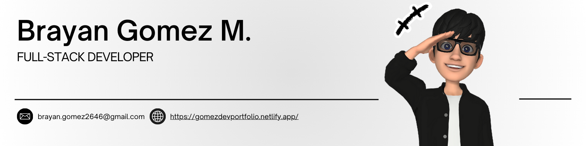

<h3 align="center">A passionate Full-Stack Web Developer</h3>

  
  
  

 

<h1>  About Me:</h1>

<ul>
  <li>💪🏻 Working on deepening my knowledge in many areas of my career.</li>
  <li>💻 Most used line of code <code>console.log("hello world")</code></li>
  <li>👨‍💻 Always eager to learn new technologies and skills.</li>
  <li>📫 How to reach me: <a href="https://www.linkedin.com/in/brayangomezm">LinkedIn</a> or <a href="mailto:brayan.gomez2646@gmail.com">Email</a></li>
  <li>🐶 Fun fact: <strong>World first developer was a woman</strong></li>
</ul>
 

  <h2 align="center">⚒️ Things I code with ⚒️</h2>

<h2 align="center">🖥️ Languages-Frameworks-Tools 🖥️</h2>
 

  
  
  
  
  

<h2 align="center">⚡ Stats ⚡</h2>
 

  
  
   
  

  

<h2 align="center">🤖 My Contributions 🤖</h2>
 

  

<h3 align="center">
    
</h3>

 

