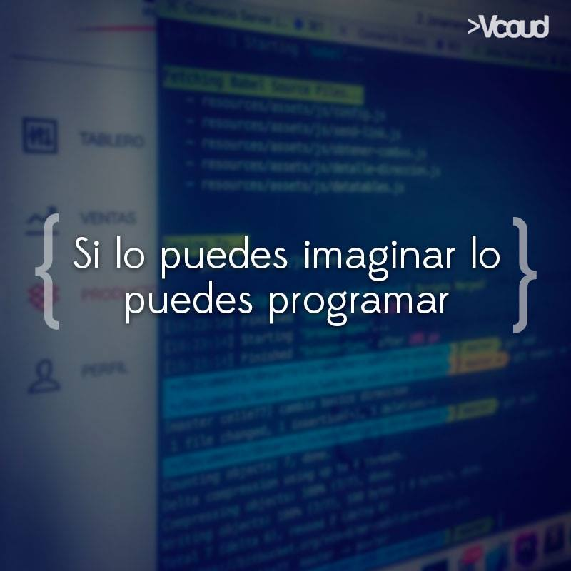

My name is Brayan Gomez. I'm currently studying systems engineering and I'm passionate about full-stack development. Here's a bit about me:

- 💪🏻 Working on: Deepening my knowledge in many areas of my career.
- 👨‍💻 Learning: Always eager to learn new technologies and skills.
- 📫 How to reach me: [LinkedIn](www.linkedin.com/in/brayangomezm) or [Email](mailto:brayan.gomez2646@gmail.com)
- 🐶 Fun fact: I'm passionate about taking courses and exploring new video games.

## Find me around the web 🌎:

- Get to know more about me [Portfolio](https://gomezdevportfolio.netlify.app/) 💻

    

## 🖥️ Languages-Frameworks-Tools 🖥️

---

## My GitHub Statistics 📊:

---
